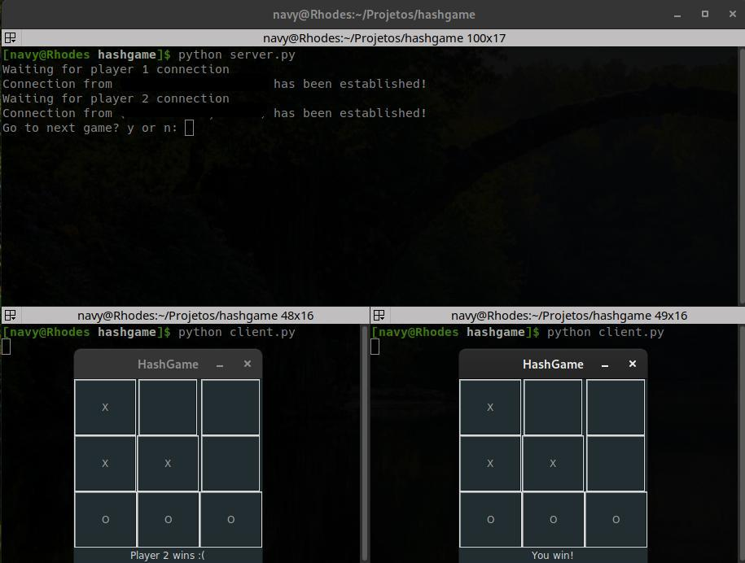

# HashGame

This is a personal project, which I code a Tic-Tac-Toe game that can be played by two clients. I've never studied about sockets, so I used TCP protocol which seems to be better but slowly. To make it easier to play I also made a GUI, using tkinter. Probably it isn't well optimized, but it works. :)

